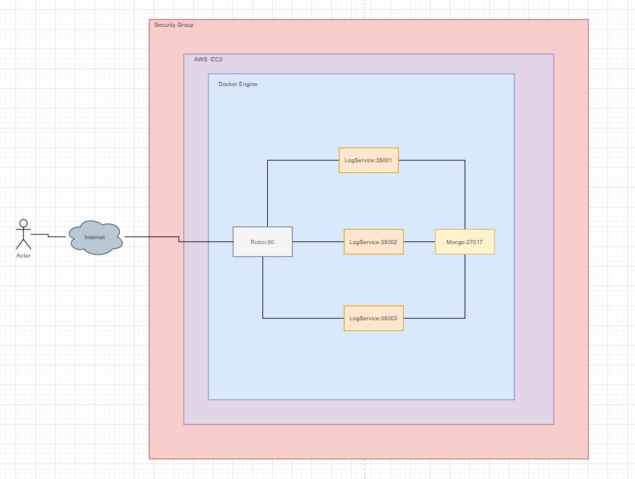
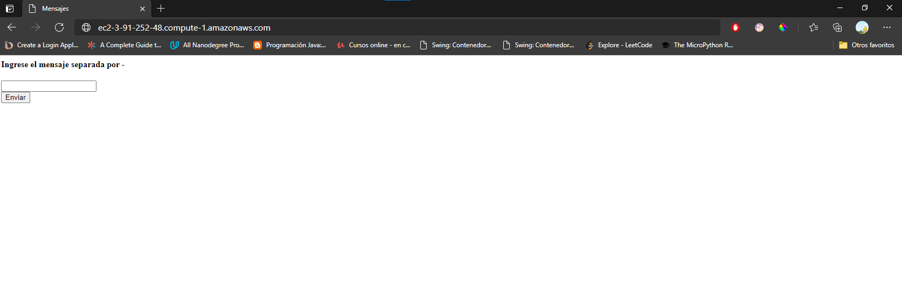
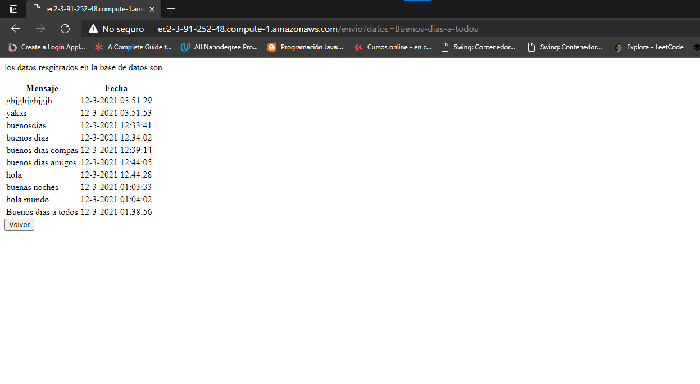

# TALLER DE DE MODULARIZACIÓN CON VIRTUALIZACIÓN E INTRODUCCIÓN A DOCKER Y A AWS

## Autor: Juan Sebastian Ramos Isaza

## Fecha: 11/03/2021

### Circleci

### Prerequisitos
Para el uso de esta aplicación se necesitan tener instalados los siguientes componentes:

* [Java 11 o superior](https://www.oracle.com/co/java/)
* [maven](https://maven.apache.org/)
* [git](https://git-scm.com/)
* [docker y docker-compose](https://www.docker.com/)

### Instalación 
1. Se debe clonar el repositorio con el siguiente comando:
    * git clone https://github.com/jsr25/Taller5Arep.git
2. Ingrese al directorio principal del proyecto con el siguiente comando:
    * cd Taller5Arep
3. Dentro del directorio encontrará dos directorios y un archivo importante los cuales son;
    * El directorio "Robin"
    * El directorio "LogService"
    * El archivo docker-compose.yml
   
### Uso
1. Para usar la aplicación debe ingresar al directorio Robin y Logservice, y ejecutar el comando:
    * mvn package
2. Después de ejecutar el comando en ambos directorios se debe parar en el directorio principal y ejecutar el siguiente comando
    * docker-compuse up
3. Cuando se termine la ejecución los contenedores quedaran prendidos y para usar el robin debe ingresar a localhost:80 y enviar su mensaje
   separado por "-".

4. Después de darle al boto enviar lo dirigirá a otra vista en la que podrá ver una tabla con los 10 últimos
   ingresos a la base de datos, y un botón para ingresar más datos.

### Arquitectura General

### Ejecucion
Actualmente la aplicación se encuentra montada en AWS, si desea probarla puede hacerlo otra vez desde la siguiente URL:
* http://ec2-3-91-252-48.compute-1.amazonaws.com/
  
  

### Implementacion en AWS
Si desean montar el servicio en AWS deben seguir los siguientes pasos:
1. Crear la instancia en AWS
2. Dentro de la instancia instalar git, docker, docker-compose
3. Deben clonar el repositorio con el comando:
    * git clone https://github.com/jsr25/Taller5Arep.git

4. Entrar al directorio principal y en los directorios Robin y LogService ejecutar:
    * mvn package

5. Se deben parar en el directorio principal y ejecutar:
    * docker-compose up

6. Los contenedores deben quedar corriendo en la máquina, ahora debe
   ir a su consola AWS en el navegador y agregarle una regla de entrada para e
   puerto 80 siguiendo el protocolo HTTP

7. Podrá ingresar a la aplicación en ejecución usando DNS público o la IP publica
   

### Javadoc
La documentación se encuentra en el directorio apidocs dentro el directorio Robin y LogService, para generar una nueva documentación
pueden hacer uso del comando mvn javadoc:javadoc en su Shell esta se generará en el directorio target/site.

### Licencia

En este proyecto se usó la licencia GNU - se puede ver [LICENSE.txt](LICENSE.txt) para más detalles.
